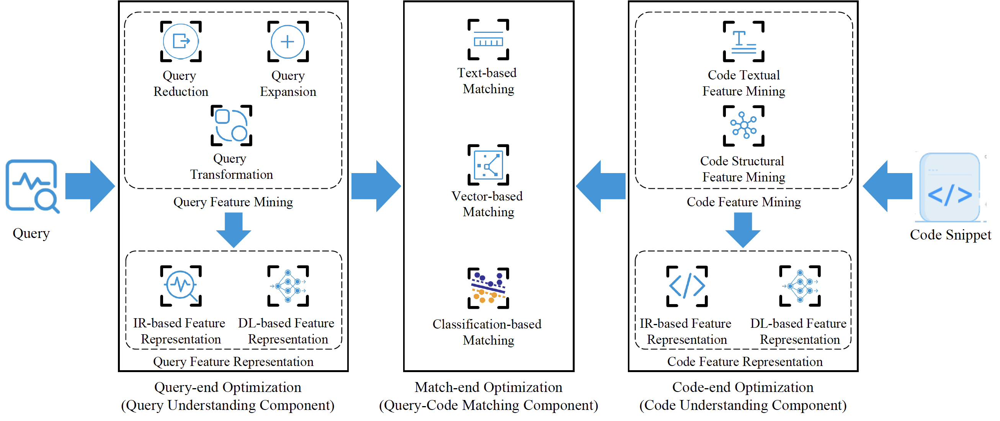

# A Survey of Source Code Search: A 3-Dimensional Perspective

A collection of academic papers on code search techniques from a **3-dimensional (query-end, code-end, match-end)** perspective. 


**NOTE: We intend to keep updating with the most recent papers whenever time permits, and we warmly welcome pull requests or issues regarding any missing papers. If you find any information is incorrect, please feel free to contact us. We will promptly confirm and make the necessary corrections. All researchers are encouraged to participate in enhancing this repository and expanding the knowledge within the field of source code search.**


[//]: # ([![Awesome]&#40;https://awesome.re/badge.svg&#41;]&#40;https://awesome.re&#41;)

[](https://https://arxiv.org/abs/2311.07107)


[//]: # (![visitor badge]&#40;https://visitor-badge.glitch.me/badge?page_id=%20QuanjunZhang.AwesomeLearningAPR&#41; )


## Citation

Please read and cite our paper: [](https://https://arxiv.org/abs/2311.07107)

```
@article{2023-Code-Search-Survey-3D-Perspective,
  title={A Survey of Source Code Search: A 3-Dimensional Perspective},
  author={Weisong Sun, Chunrong Fang, Yifei Ge, Yuling Hu, Yuchen Chen, Quanjun Zhang, Xiuting Ge, Yang Liu, Zhenyu Chen},
  journal={arXiv preprint arXiv:2301.03270},
  year={2023}
}
```

----------

## Overall Framework of the code search technique

----------

## Collected Papers in Query End
| **Paper Title** | **Venue** | **Year** | **Code Available**                           |
| --------------- | -- |------|----------------------------------------------|
| [Augmenting and structuring user queries to support efficient free-form code search](http://link.springer.com/10.1007/s10664-017-9544-y) | _ESE_ | 2018 | no                                           |
| [Automatic query reformulation for code search using crowdsourced knowledge](http://link.springer.com/10.1007/s10664-018-9671-0) | _ESE_ | 2019 | no                                           |
| [CodeHow: Effective Code Search Based on API Understanding and Extended Boolean Model](http://ieeexplore.ieee.org/document/7372014/) | _ASE_ | 2015 | no |
| [CONQUER: A Tool for NL-based Query Refinement & Contextualizing Code Search Results](https://ieeexplore.ieee.org/abstract/document/6676945/) | _ICSME_ | 2013 | no |
| [Deep learning the semantics of change sequences for query expansion](https://onlinelibrary.wiley.com/doi/10.1002/spe.2736) | _SPE_ | 2019 | no                                           |
| [Effective Reformulation of Query for Code Search using Crowdsourced Knowledge and Extra-Large Data Analytics](http://arxiv.org/abs/1807.08798) | _ICSME_ | 2018 | no                                           |
| [Enhancing example-based code search with functional semantics](https://linkinghub.elsevier.com/retrieve/pii/S0164121220300492) | _JSS_ | 2020 | no                                           |
| [Enriching Query Semantics for Code Search with Reinforcement Learning](http://arxiv.org/abs/2105.09630) | _arXiv_ | 2021 | no |
| [Expanding Queries for Code Search Using Semantically Related API Class-names](https://ieeexplore.ieee.org/document/8031055/) | _TSE_ | 2018 | no |
| [Hyperbolic Code Retrieval: A Novel Approach for Efficient Code Search Using Hyperbolic Space Embeddings](http://arxiv.org/abs/2308.15234) | _arXiv_ | 2023 | no |
| [IECS: Intent-Enforced Code Search via Extended Boolean Model](https://www.medra.org/servlet/aliasResolver?alias=iospress&doi=10.3233/JIFS-161994) | _IFS_ | 2017 | no |
| [Improving source code search with natural language phrasal representations of method signatures](http://ieeexplore.ieee.org/document/6100115/) | _ASE_ | 2011 | no |
| [Interactive Query Reformulation for Source-Code Search With Word Relations](https://ieeexplore.ieee.org/document/8552658/) | _IEEE Access_ | 2018 | no |
| [LANGUAGE-AGNOSTIC SOURCE CODE RETRIEVAL USING KEYWORD & IDENTIFIER LEXICAL PATTERN](http://ieeexplore.ieee.org/document/7372014/) | _IJSECS_ | 2018 | no |
| [Neural query expansion for code search](https://dl.acm.org/doi/10.1145/3315508.3329975) | _PLDI_ | 2019 | no |
| [Query Expansion Based on Crowd Knowledge for Code Search](http://ieeexplore.ieee.org/document/7462267/) | _Trans. Serv. Comput._ | 2016 | no |
| [Query expansion based on statistical learning from code changes](http://ieeexplore.ieee.org/document/7372014/) | _SPE_ | 2018 | no |
| [Query expansion via WordNet for effective code search](http://ieeexplore.ieee.org/document/7081874/) | _SANER_ | 2015 | no |
| [RACK: Automatic API Recommendation Using Crowdsourced Knowledge](http://ieeexplore.ieee.org/document/7476656/) | _SANER_ | 2016 | no |
| [RunEx: Augmenting Regular-Expression Code Search with Runtime Values](https://from.so/static/dbaae30940b60addb67914a0cf61f215/Run_Exp_VLHCC_2023_386558a2d3.pdf) | _VL/HCC_ | 2023 | no |
| [Search for Compatible Source Code](https://www.worldscientific.com/doi/abs/10.1142/S0218194021500169) | _IJSEKE_ | 2021 | no |
| [Self-Supervised Query Reformulation for Code Search](http://arxiv.org/abs/2307.00267) | _arXiv_ | 2023 | [yes](https://github.com/RedSmallPanda/SSQR) |
| [SWIM: synthesizing what i mean: code search and idiomatic snippet synthesis](https://dl.acm.org/doi/10.1145/2884781.2884808) | _ICSE_ | 2016 | no |
| [Unsupervised software repositories mining and its application to code search](https://dl.acm.org/doi/10.1145/3315508.3329975) | _SPE_ | 2020 | no |
| [XCoS: Explainable Code Search Based on Query Scoping and Knowledge Graph](https://dl.acm.org/doi/10.1145/3315508.3329975) | _TOSEM_ | 2023 | no |


----------

## Collected Papers in Code End
| **Paper Title** | **Venue** | **Year** | **Code Available**|
| --------------- | ---- | ---- | -- |
| [A Multi-Perspective Architecture for Semantic Code Search](https://www.aclweb.org/anthology/2020.acl-main.758) | _ACL_     | 2020     | [yes](https://github.com/rajarshihaldar/codetextmatch) |
| [A neural framework for retrieval and summarization of source code](https://dl.acm.org/doi/10.1145/3238147.3240471) | _ASE_     | 2018     | no              |
| [Adaptive Deep Code Search](https://dl.acm.org/doi/10.1145/3387904.3389278) | _ICPC_     | 2020     | no |
| [An Intelligent Code Search Approach Using Hybrid Encoders](https://www.hindawi.com/journals/wcmc/2021/9990988/) | _Wirel. Commun. Mob. Comput._ | 2021 | no                                            |
| [Boosting Code Search with Structural Code Annotation](https://www.mdpi.com/2079-9292/11/19/3053)  | _Electronics_    | 2022     | no  |
| [CodeHow: Effective Code Search Based on API Understanding and Extended Boolean Model](http://ieeexplore.ieee.org/document/7372014/) | _ASE_ | 2015 | no |
| [CoNCRA: A Convolutional Neural Network Code Retrieval Approach](http://arxiv.org/abs/2009.01959)   | _arXiv_     | 2022     | no                                            |
| [COSEA: Convolutional Code Search with Layer-wise Attention](http://arxiv.org/abs/2010.09520)  | _arXiv_ | 2020  | no                                            |
| [CRaDLe: Deep Code Retrieval Based on Semantic Dependency Learning](http://arxiv.org/abs/2012.01028) | _arXiv_     | 2020     | no |
| [CSRS: Code Search with Relevance Matching and Semantic Matching](http://arxiv.org/abs/2203.07736) | _arXiv_     | 2022   | no |
| [CSSAM:Code Search via Attention Matching of Code Semantics and Structures](http://arxiv.org/abs/2208.03922) | _arXiv_     | 2022  | no |
| [Deep code search](https://dl.acm.org/doi/10.1145/3180155.3180167) | _ICSE_     | 2018     | [yse](https://github.com/guxd/deep-code-search) |
| [Deep Graph Matching and Searching for Semantic Code Retrieval](https://dl.acm.org/doi/10.1145/3447571) | _Trans. Knowl. Discov. Data_     | 2021     | [yes](https://github.com/ryderling/DGMS) |
| [deGraphCS: Embedding Variable-based Flow Graph for Neural Code Search](http://arxiv.org/abs/2103.13020) | _TOSEM_     | 2021     | [yse](https://github.com/degraphcs/DeGraphCS) |
| [FACER: An API Usage-based Code-example Recommender for Opportunistic Reuse](https://link.springer.com/article/10.1007/s10664-021-10000-w) | _Empir. Softw. Eng._     | 2021     | no |
| [Fine-grained Co-Attentive Representation Learning for Semantic Code Search](https://ieeexplore.ieee.org/document/9825816/) | _SANER_     | 2022     | [yes](https://github.com/cqu-isse/FcarCS) |
| [GraphSearchNet: Enhancing GNNs via Capturing Global Dependencies for Semantic Code Search](https://ieeexplore.ieee.org/document/10005619) | _TSE_     | 2023     | [yes](https://github.com/shangqing-liu/GraphSearchNet) |
| [Improving Code Search with Co-Attentive Representation Learning](https://dl.acm.org/doi/10.1145/3387904.3389269) | _ICPC_     | 2020     | no |
| [Incorporating Code Structure and Quality in Deep Code Search](https://www.mdpi.com/2076-3417/12/4/2051) | _Applied Sciences_     | 2022     | no |
| [Is a Single Model Enough? MuCoS: A Multi-Model Ensemble Learning for Semantic Code Search](http://arxiv.org/abs/2107.04773) | _arXiv_     | 2021    | no |
| [Joint Embedding of Semantic and Statistical Features for Effective Code Search](https://www.mdpi.com/2076-3417/12/19/10002) | _Applied Sciences_     | 2022     | no |
| [Learning Deep Semantic Model for Code Search using CodeSearchNet Corpus](http://arxiv.org/abs/2201.11313) | _arXiv_     | 2022     | [yes](https://github.com/overwindows/SemanticCodeSearch) |
| [Multi-modal Attention Network Learning for Semantic Source Code Retrieval](https://ieeexplore.ieee.org/document/8952337/) | _ASE_     | 2019    | no |
| [Multimodal Representation for Neural Code Search](http://arxiv.org/abs/2107.00992) | _ICSME_     | 2021     | [yes](https://github.com/jianguda/mrncs) |
| [Neural joint attention code search over structure embeddings for software Q&A sites](https://linkinghub.elsevier.com/retrieve/pii/S0164121220301886) | _JSS_     | 2020    | [yes](https://github.com/hoogang/NJACS) |
| [Portfolio: finding relevant functions and their usage](https://dl.acm.org/doi/10.1145/1985793.1985809) | _ICSE_     | 2011    | no |
| [PSCS: A Path-based Neural Model for Semantic Code Search](http://arxiv.org/abs/2008.03042) | _arXiv_     | 202     | no |
| [Self-Attention Networks for Code Search](https://linkinghub.elsevier.com/retrieve/pii/S0950584921000288) | _Inf. Softw. Technol._     | 2021   | [yes](https://github.com/TomasAndersonFang/SANCS) |
| [Recommendation Based on Java Code Analysis and Search](https://ebooks.iospress.nl/doi/10.3233/FAIA200728) | FSDM                          | 2020     | [yes](https://github.com/fushanqing/CodeTip)             |
| [CSDA: A novel attention-based LSTM approach for code search](https://iopscience.iop.org/article/10.1088/1742-6596/1544/1/012056/meta) | JPCS                          | 2020     | no                                                       |
| [Sourcerer: mining and searching internet-scale software repositories](http://link.springer.com/10.1007/s10618-008-0118-x) | _Data Min. Knowl. Discov._     | 2009    | no |
| [Two-Stage Attention-Based Model for Code Search with Textual and Structural Features](https://ieeexplore.ieee.org/document/9425924/) | _SANER_     | 2021     | [yes](https://github.com/cqu-isse/TabCS) |
| [Utilizing Edge Attention in Graph-Based Code Search](http://ksiresearchorg.ipage.com/seke/seke22paper/paper078.pdf) | _SEKE_     | 2022    | no |

----------
## Collected Papers in Match End
| **Paper Title** | **Venue** | **Year** | **Code Available**|
| --------------- | ---- | ---- | -- |
| [A Compare-Aggregate Model for Matching Text Sequences](http://arxiv.org/abs/1611.01747) | _arXiv_ | 2016 | [yes](https://github.com/shuohangwang/SeqMatchSeq) |
| [Accelerating Code Search with Deep Hashing and Code Classification](http://arxiv.org/abs/2203.15287) | _arXiv_ | 2022 | no |
| [Cascaded Fast and Slow Models for Efficient Semantic Code Search](http://arxiv.org/abs/2110.07811) | _arXiv_ | 2022 | no |
| [CoaCor: Code Annotation for Code Retrieval with Reinforcement Learning](http://arxiv.org/abs/1904.00720) | _arXiv_ | 2018 | [yes](https://github.com/LittleYUYU/CoaCor.) |
| [Code recommendation for android development: how does it work and what can be improved?](http://link.springer.com/10.1007/s11432-017-9058-0) | _SCI_ | 2017 | no |
| [CodeBERT: A Pre-Trained Model for Programming and Natural Languages](http://arxiv.org/abs/2002.08155) | _arXiv_ | 2020 | [yes](https://github.com/microsoft/CodeBERT) |
| [CodeMatcher: Searching Code Based on Sequential Semantics of Important Query Words](http://arxiv.org/abs/2005.14373) | _Trans. Softw. Eng. Methodol._ | 2022 | no |
| [OCoR: An Overlapping-Aware Code Retriever](https://dl.acm.org/doi/10.1145/1122445.1122456) | _Comput. Surv._ | 2022 | [yes](https://github.com/anyone546/OCoR.) |
| [GraphCodeBERT: Pre-training Code Representations with Data Flow](http://arxiv.org/abs/2009.08366) | _arXiv_ | 2021 | no |
| [GraphSearchNet: Enhancing GNNs via Capturing Global Dependencies for Semantic Code Search](http://arxiv.org/abs/2111.02671) | _arXiv_ | 2021 | no |
| [Learning to rank code examples for code search engines](http://link.springer.com/10.1007/s10664-015-9421-5) | _Empir. Softw. Eng._ | 2017 | no |
| [ROSF: Leveraging Information Retrieval and Supervised Learning for Recommending Code Snippets](https://ieeexplore.ieee.org/document/7516727/) |  _Trans. Serv. Comput._ | 2022 | no |
| [Self-Supervised Contrastive Learning for Code Retrieval and Summarization via Semantic-Preserving Transformations](http://arxiv.org/abs/2009.02731) | _SIGIR_ | 2021 | no |
| [SPT-Code: Sequence-to-Sequence Pre-Training for Learning Source Code Representations](http://arxiv.org/abs/2201.01549) | _arXiv_ | 2022 | no |
| [TranS^3: A Transformer-based Framework for Unifying Code Summarization and Code Search](http://arxiv.org/abs/2003.03238) | _arXiv_ | 2020 | no |

